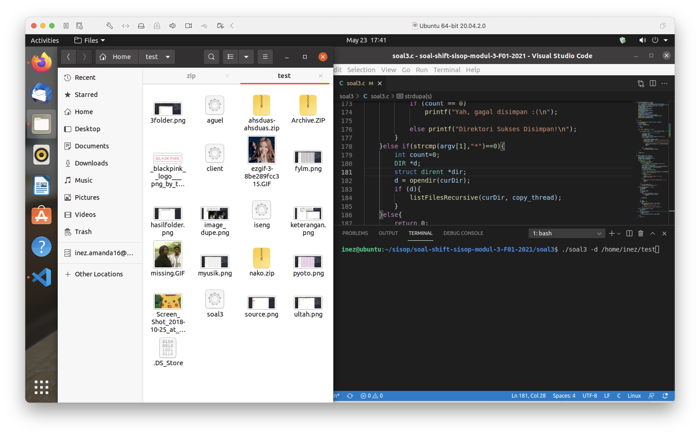

# soal-shift-sisop-modul-3-F01-2021

## Soal Nomor 1
Keverk adalah orang yang cukup ambisius dan terkenal di angkatannya. Sebelum dia menjadi ketua departemen di HMTC, dia pernah mengerjakan suatu proyek dimana keverk tersebut meminta untuk membuat server database buku. Proyek ini diminta agar dapat digunakan oleh pemilik aplikasi dan diharapkan bantuannya dari pengguna aplikasi ini. 

### A. intinya server bisa multi-connections, sama pas client terkonek ke server tampilkan pilihan LOGIN atau REGISTER. Ketika register username dan password disimpan pada file akun.txt dengan format [username]:[password]

Untuk soal ini, kami menggunakan 
```C++
while( (new_socket = accept(socket_desc, (struct sockaddr *)&client, (socklen_t*)&c)) )
{
    puts("Connection accepted");
    
    pthread_t sniffer_thread;
    new_sock = malloc(1);
    *new_sock = new_socket;
    
    if( pthread_create( &sniffer_thread , NULL ,  connection_handler , (void*) new_sock) < 0)
    {
        perror("could not create thread");
        return 1;
    }
    
    //Now join the thread , so that we dont terminate before the thread
    pthread_join( sniffer_thread , NULL);
    puts("Handler assigned");
}
```
kegunaan `while` tersebut agar server selalu jalan dan ketika client terputus, maka server akan kembali mencari client lain. 

Untuk REGISTER (Pilihan 1), akan membuka file akun.txt dan melakukan append.
```C++
.
.
.
// SERVER
if (!(strcmp(choice, "1")))
{
    FILE* fp = fopen("akun.txt", "a");
    // printf("Masuk 1\n");
    sprintf(menu, "Username : \e[s\n\e[u");
    write(sock, menu, 1024); 
    // memset(menu, '0', 1024);
    bzero(menu, 1024);
    valread = read(sock, username, 1024);
    if (valread < 1) return 0;

    sprintf(menu, "Password : \e[s\n\e[u");
    write(sock, menu, 1024); 
    // memset(menu, '0', 1024);
    bzero(menu, 1024);
    valread = read(sock, password, 1024);
    if (valread < 1) return 0;

    fprintf(fp, "%s:%s\n", username, password);
    fclose(fp);
}
.
.
.
```
sementara untuk REGISTER pada client, 
```C++
.
.
.
if (!(strcmp(choice, "1")))
{
    valread = read(sock, buffer, 1024);
    printf("%s", buffer);
    scanf(" %[^\n]s", username);
    write(sock, username, 1024);

    valread = read(sock, buffer, 1024);
    printf("%s", buffer); 
    scanf(" %[^\n]s", password);
    write(sock, password, 1024);
}
.
.
.
```

Untuk LOGIN (pilihan 2), akan membuka file akun.txt dan melakukan read serta komparasi untuk username dan password.
**SERVER**
```C++
.
.
.
else if (!(strcmp(choice, "2")))
{
    char* aut = "0";
    FILE* fp = fopen("akun.txt", "r");
    while (aut == "0")
    {
        // memset(menu, '0', 1024);
        bzero(menu, 1024);
        // printf("Masuk 2\n");
        sprintf(menu, "Username : \e[s\n\e[u");
        // printf("%s\n", menu);
        int ler = write(sock, menu, 1024);
        // if (ler == 0) printf("write\n");
        // memset(menu, '0', 1024);
        bzero(menu, 1024);
        valread = read(sock, username, 1024);
        if (valread < 1) return 0;

        sprintf(menu, "Password : \e[s\n\e[u");
        write(sock, menu, 1024); 
        // memset(menu, '0', 1024);
        bzero(menu, 1024);
        valread = read(sock, password, 1024); 
        if (valread < 1) return 0;

        while (fgets(buffer, 1024, fp) != NULL && aut == "0") 
        {
            char f_username[1024], f_password[1024];
            char *token = strtok(buffer, ":");
            strcpy(f_username, token);
            token = strtok(NULL, "\n");
            strcpy(f_password, token);
            
            if (strcmp(username, f_username) == 0 && strcmp(password, f_password) == 0)
            {
                // printf("MASUK!!!\n");
                aut = "1";
                write(sock, aut, 1024);
                // printf("%s", aut);
            }
        }
    }
    .
    .
    .
```
**CLIENT**
```C++
.
.
.
else if (!(strcmp(choice, "2")))
{
    while (1)
    {
        char aut[1024] = {0};
        while (strcmp(aut, "") == 0)
        {
            // printf("masuk 2\n");
            bzero(buffer, 1024);
            valread = read(sock, buffer, 1024);
            printf("%s", buffer);
            scanf(" %[^\n]s", username);
            write(sock, username, 1024);

            bzero(buffer, 1024);
            valread = read(sock, buffer, 1024);
            printf("%s", buffer); 
            scanf(" %[^\n]s", password);
            write(sock, password, 1024);

            valread = read(sock, aut, 1024);
        }
    .
    .
    .
```
jika username dan password yang dimasukkan oleh client sesuai, maka variabel `aut` akan berubah menjadi 1 yang berarti login telah berhasil.

### B. Sistem memiliki sebuah database yang bernama files.tsv. Isi dari files.tsv ini adalah path file saat berada di server, publisher, dan tahun publikasi. Setiap penambahan dan penghapusan file pada folder file yang bernama  FILES pada server akan memengaruhi isi dari files.tsv. Folder FILES otomatis dibuat saat server dijalankan. 

Untuk persoalan ini kita diminta untuk setiap command `add` dan juga `delete` akan merubah isi dari `files.tsv`.

**SERVER**
```C++
if (!strcmp(choice, "add"))
{
    FILE* fp_1 = fopen("files.tsv", "a");
    .
    .
    .
    fprintf(fp_1, "%s\t%s\t%s\n", publisher, tahun, pathServer);
    fclose(fp_1);
    .
    .
    .
}
```

**SERVER**
```C++
else if (!strncmp(choice, "delete", 6))
{
    .
    .
    .

            FILE* file1 = fopen("files.tsv", "r");
            FILE* file2 = fopen("temp.tsv", "w");
            .
            .
            .
            fclose(file1);
            fclose(file2);
            remove("files.tsv");
            rename("temp.tsv", "files.tsv");
    .
    .
    .
}
```

### C. membuat command ADD buat nambahinh file dari client ke server

**SERVER**
```C++
if (!strcmp(choice, "add"))
{
    FILE* fp_1 = fopen("files.tsv", "a");
    char publisher[1024] = {0};
    char tahun[1024] = {0};
    char path[1024] = {0};

    sprintf(publisher, "Publisher : \e[s\n\e[u");
    write(sock, publisher, 1024);
    // memset(publisher, '0', 1024);
    bzero(publisher, 1024);
    valread = read(sock, publisher, 1024);
    if (valread < 1) return 0;
    
    sprintf(tahun, "Tahun Publikasi : \e[s\n\e[u");
    write(sock, tahun, 1024);
    // memset(tahun, '0', 1024);
    bzero(tahun, 1024);
    valread = read(sock, tahun, 1024);
    if (valread < 1) return 0;

    sprintf(path, "Filepath : \e[s\n\e[u");
    write(sock, path, 1024);
    // memset(path, '0', 1024);
    bzero(path, 1024);
    valread = read(sock, path, 1024);
    if (valread < 1) return 0;
    
    // transfer file
    mkdir("FILES", 0777);
    char pathServer[1024];
    sprintf(pathServer, "/home/azhar416/soal-shift-sisop-modul-3-F01-2021/soal1/server/FILES/");
    strcat(pathServer, path);
    FILE* file_create = fopen(pathServer, "w");

    // memset(buffer, '0', 1024);
    bzero(buffer, 1024);
    valread = read(sock, buffer, 1024);
    if (valread < 1) return 0;
    fprintf(file_create, "%s", buffer);
    // fprintf(file_create, "\n");

    fclose(file_create);

    // memset(buffer, '0', 1024);
    bzero(buffer, 1024);
    sprintf(buffer, "\nFile Terkirim\n");
    write(sock, buffer, 1024);

    fprintf(fp_1, "%s\t%s\t%s\n", publisher, tahun, pathServer);
    fclose(fp_1);

    FILE* log = fopen("running.log", "a");
    fprintf(log, "Tambah : %s %s\n", path, username);
    fclose(log);
}
```
server akan menerima command `add` dari client kemudian akan mencatat detail - detail dari file yang akan dimasukkan ke dalam `files.tsv`.
setelah itu server akan membuat file baru pada `directory FILES` yang sama persis dengan file yang ada pada client.

**CLIENT**
```C++
if (!strcmp(choice, "add"))
{
    char kirim[1024] = {0};
    valread = read(sock, buffer, 1024);
    printf("%s", buffer);
    // memset(buffer, '0', 1024);
    bzero(buffer, 1024);
    scanf("%s", kirim);
    write(sock, kirim, 1024);
    // memset(kirim, '0', 1024);
    bzero(buffer, 1024);
    
    valread = read(sock, buffer, 1024);
    printf("%s", buffer);
    // memset(buffer, '0', 1024);
    bzero(buffer, 1024);
    scanf("%s", kirim);
    write(sock, kirim, 1024);
    // memset(kirim, '0', 1024);
    bzero(buffer, 1024);
    
    valread = read(sock, buffer, 1024);
    printf("%s", buffer);
    scanf("%s", kirim);
    write(sock, kirim, 1024);
    // memset(kirim, '0', 1024); // file.extensi
    printf("%s", kirim);

    FILE* file = fopen(kirim, "rb");
    char data[1024] = {0};

    while(fgets(data, 1024, file) != NULL)
    {
        write(sock, data, strlen(data));
        // memset(data, '0', 1024);
        bzero(data, 1024);
    }
    fclose(file);

}
```
client akan mengirimkan command `add` ke server dan kemudian akan mengirim data - data file tersebut. kemudian isi dari file yang ingin dikirim tersebut di read dan di passing ke socket dan nanti server akan menerima isi dari file tersebut.

### D. membuat command download [filename].[extensi] untuk memindahkan file dari server ke client

**SERVER**
```C++
else if (!strncmp(choice, "download", 8))
{
    bzero(buffer, 1024);
    char temp[1024], buku[1024];
    strcpy(temp, choice);
    // printf("CHOICE : %s\n", choice);
    char* save = temp;
    char* token;
    for (int i = 0; token = strtok_r(save, " ", &save); i++)
    {
        bzero(buku, 1024);
        strcpy(buku, token);
    }
    int found = 0;
    printf("buku : %s\n", buku);
    
    if (!strcmp(buku, ""))
    {
        strcpy(buffer, "masukkan nama buku");
        write(sock, buffer, 1024);
        bzero(buffer, 1024);
    }
    else
    {
        char pathserver[1024] = "/home/azhar416/soal-shift-sisop-modul-3-F01-2021/soal1/server/FILES/";
        strcat(pathserver, buku);
        printf("pathserver : %s\n", pathserver);

        FILE* file = fopen("files.tsv", "r");
        char line[1024];

        while(fgets(line, 1024, file))
        {
            char temp[1024] = {0}, data[1024] = {0};
            strcpy(temp, line);
            char* t;
            char* simpen = temp;
            for (int i = 0; t = strtok_r(simpen, "\t", &simpen); i++)
            {
                strncpy(data, t, strlen(t) - 1);
            }
            printf("data : %s\n", data);
            if (!strcmp(pathserver, data))
            {
                found = 1;
                break;
            }
        }
        if (found)
        {
            FILE* ffile = fopen(pathserver, "rb");
            char dats[1024] = {0};
            
            while (fgets(dats, 1024, ffile) != NULL)
            {
                write(sock, dats, strlen(dats));
                bzero(dats, 1024);
            }
            fclose(ffile);

        }
        else
        {
            strcpy(buffer, "buku tidak ditemukan");
            write(sock, buffer, 1024);
            bzero(buffer, 1024);
        }

    }
}
```
server akan menerima command `download` serta nama file dan extensinya.
kemudian nama file tersebut di cek pada `files.tsv`, jika ada maka server akan melakukan read data pada file tersebut dan kemudian data tersebut dikirimkan ke client.


**CLIENT**
```C++
else if (!strncmp(choice, "download", 8))
{
    // printf("flag1\n");
    char buku[1024];
    strcpy(buku, choice);
    char* token;
    char* simpen = buku;
    for (int i = 0; token = strtok_r(simpen, " ", &simpen); i++)
    {
        // printf("flag2\n");
        bzero(buffer, 1024);
        strcpy(buffer, token);
    }
    char pathclient[1024] = "/home/azhar416/soal-shift-sisop-modul-3-F01-2021/soal1/client/";
    strcat(pathclient, buffer);
    
    bzero(buffer, 1024);
    if (strcmp(buffer, "buku tidak ditemukan") && strcmp(buffer, "masukkan nama buku"))
    {
        FILE* file = fopen(pathclient, "w");

        valread = read(sock, buffer, 1024);
        fprintf(file, "%s", buffer);
    

        fclose(file);
        printf("buku telah diunduh\n\n");
    }
    else
    {
        printf("%s\n", buffer);
    }
}
```
client akan mengirimkan command `download` beserta namafile dan extensi.
jika nama file tersebut ditemukan, server akan membacanya dan mengirim ke client. pada saat ini client akan menerima datanya dan akan membuat file baru dengan nama file dan extensi yang sama.

### E. Setelah itu, client juga dapat menghapus file yang tersimpan di server. Akan tetapi, Keverk takut file yang dibuang adalah file yang penting, maka file hanya akan diganti namanya menjadi ‘old-NamaFile.ekstensi’. Ketika file telah diubah namanya, maka row dari file tersebut di file.tsv akan terhapus.

persoalan ini meminta kami untuk melakukan delete file pada server, tetapi tidak sepenuhnya terhapus. file pada server akan berubah nama menjadi `old-[namafile].[extensi]`. pada `files.tsv` juga akan terhapus detail - detail dari nama file tersebut.

**SERVER**
```C++
else if (!strncmp(choice, "delete", 6))
{
    bzero(buffer, 1024);
    char temp[1024] = {0}, buku[1024]= {0};
    strcpy(temp, choice);
    char* token;
    char* save = temp;
    for (int i = 0; token = strtok_r(save, " ", &save); i++)
    {
        strcpy(buku, token);
    }
    char pathserver[1024] = "/home/azhar416/soal-shift-sisop-modul-3-F01-2021/soal1/server/FILES/";
    strcat(pathserver, buku);

    if (!strcmp(buku, ""))
    {
        strcpy(buffer, "masukkan nama buku");
    }
    else
    {
        FILE* cekfile = fopen(pathserver, "r");
        if (!cekfile)
        {
            strcpy(buffer, "buku tidak ditemukan");
        }
        else
        {
            FILE* file1 = fopen("files.tsv", "r");
            FILE* file2 = fopen("temp.tsv", "w");

            char line[1024] = {0};
            while (fgets(line, 1024, file1))
            {
                char motong[1024], pathbukunya[1024];
                strcpy(motong, line);
                char* potong = motong;
                char* token;
                for (int i = 0; token = strtok_r(potong, "\t", &potong); i++)
                {
                    strncpy(pathbukunya, token, strlen(token) - 1);
                }
                char templine[1024];
                strcpy(templine, line);
                if (strcmp(pathserver, pathbukunya))
                {
                    printf("pathserver : %s\npathbukunya : %s\n\n", pathserver, pathbukunya);
                    fprintf(file2, "%s", templine);
                }
            }
            fclose(file1);
            fclose(file2);
            remove("files.tsv");
            rename("temp.tsv", "files.tsv");

            char old[1024] = "/home/azhar416/soal-shift-sisop-modul-3-F01-2021/soal1/server/FILES/old-";
            strcat(old, buku);
            rename(pathserver, old);

            strcpy(buffer, "buku sukses dihapus");
        }
        fclose(cekfile);

        FILE* log = fopen("running.log", "a")		;
        fprintf(log, "Hapus : %s %s\n", buku, username);
        fclose(log);				
    }
    write(sock, buffer, 1024);
    bzero(buffer, 1024);
}
```

**CLIENT**
```C++
else if (!strncmp(choice, "delete", 6))
{
    bzero(buffer, 1024);
    valread = read(sock, buffer, 1024);
    printf("%s\n", buffer);
    bzero(buffer, 1024);
}
```

### F. Client dapat melihat semua isi files.tsv dengan memanggil suatu perintah yang bernama see. Output dari perintah tersebut keluar dengan format. 

untuk persoalan ini, kami membuka `files.tsv` lalu file tersebut diambil data - data yang dibutuhkan untuk ditampilkan.

**SERVER**
```C++
else if (!strcmp(choice, "see"))
{
    // memset(buffer, '0', 1024);

    FILE* fcek = fopen("files.tsv", "r");

    char 	line[1024] = {0}, pub[1024] = {0}, thn[1024] = {0}, p_path[1024] = {0}, 
            pathTemp[1024] = {0}, namafile[1024] = {0}, nama[1024] = {0}, extensi[1024] = {0};
    int bukanawal = 0;
    strcpy(buffer, "");
    while (fgets(line, 1024, fcek))
    {
        // "/home/azhar416/sisop..../soal1/
        // printf("ler\n");
        // if (bukanawal) 
        strcat(buffer, "\n\n");

        // ngambil tiap tab
        char* token;
        char samlekom1[1024];
        strcpy(samlekom1, line);
        char* kumsalam = samlekom1;
        for (int i = 0; token = strtok_r(kumsalam, "\t", &kumsalam); i++)
        {
            if (i == 0) 
                strcpy(pub, token);
            else if (i == 1) 
                strcpy(thn, token);
            else if (i == 2) 
                strcpy(p_path, token);
        }
        strcpy(pathTemp, p_path);

        // ngambil namafile.extensi
        char samlekom2[1024];
        strcpy(samlekom2, pathTemp);
        kumsalam = samlekom2;
        for (int i = 0; token = strtok_r(kumsalam, "/", &kumsalam); i++)
        {
            strcpy(namafile, token);
        }

        // misah namafile ama extensi
        char samlekom3[1024];
        strcpy(samlekom3, namafile);
        kumsalam = samlekom3;
        for (int i = 0; token = strtok_r(kumsalam, ".", &kumsalam); i++)
        {
            if (i == 0) 
                strcpy(nama, token);
            else if (i == 1) 
            {
                strcpy(extensi, ".");
                strcat(extensi, token);
            }
        }
        // printf("%s\n%s\n%s\n%s\n%s\n", nama, pub, thn, extensi, p_path);

        strcat(buffer, "Nama : ");
        strcat(buffer, nama);
        strcat(buffer, "\nPublisher : ");
        strcat(buffer, pub);
        strcat(buffer, "\nTahun Publishing : ");
        strcat(buffer, thn);
        strcat(buffer, "\nEkstensi File : ");
        strcat(buffer, extensi);
        strcat(buffer, "File Path : ");
        strcat(buffer, p_path);

        bukanawal++;
    }
    // printf("%s", buffer);
    write(sock, buffer, 1024);
    bzero(buffer, 1024);
    // memset(buffer, '0', 1024);
}
```

**CLIENT**
```C++
else if (!strcmp(choice, "see"))
{
    bzero(buffer, 1024);
    read(sock, buffer, 1024);
    printf("%s", buffer);
    bzero(buffer, 1024);
}
```

### G. Aplikasi client juga dapat melakukan pencarian dengan memberikan suatu string. Hasilnya adalah semua nama file yang mengandung string tersebut. Format output seperti format output f.

pada persoalaan ini, mirip seperti command `see` tetapi bedanya pada komparasi. pada command `find` yang akan ditampilkan hanya nama file yang dicari.

**SERVER**
```C++
else if (!strncmp(choice, "find", 4))
{
    char temp[1024], namabuku[1024];
    strcpy(temp, choice);
    char* p_temp = temp;
    char* token;
    for (int i = 0; token = strtok_r(p_temp, " ", &p_temp); i++)
    {
        strcpy(namabuku, token);
    }
    if (!strcmp(namabuku, ""))
    {
        strcpy(buffer, "masukkan nama buku");
    }
    else
    {
        FILE* fcek = fopen("files.tsv", "r");

        char 	line[1024] = {0}, pub[1024] = {0}, thn[1024] = {0}, p_path[1024] = {0}, 
                pathTemp[1024] = {0}, namafile[1024] = {0}, nama[1024] = {0}, extensi[1024] = {0};
        int bukanawal = 0;
        strcpy(buffer, "");
        while (fgets(line, 1024, fcek))
        {
            // "/home/azhar416/sisop..../soal1/
            // printf("ler\n");
            // if (bukanawal) 
            strcat(buffer, "\n\n");

            // ngambil tiap tab
            char* token;
            char samlekom1[1024];
            strcpy(samlekom1, line);
            char* kumsalam = samlekom1;
            for (int i = 0; token = strtok_r(kumsalam, "\t", &kumsalam); i++)
            {
                if (i == 0) 
                    strcpy(pub, token);
                else if (i == 1) 
                    strcpy(thn, token);
                else if (i == 2) 
                    strcpy(p_path, token);
            }
            strcpy(pathTemp, p_path);

            // ngambil namafile.extensi
            char samlekom2[1024];
            strcpy(samlekom2, pathTemp);
            kumsalam = samlekom2;
            for (int i = 0; token = strtok_r(kumsalam, "/", &kumsalam); i++)
            {
                strcpy(namafile, token);
            }

            // misah namafile ama extensi
            char samlekom3[1024];
            strcpy(samlekom3, namafile);
            kumsalam = samlekom3;
            for (int i = 0; token = strtok_r(kumsalam, ".", &kumsalam); i++)
            {
                if (i == 0) 
                    strcpy(nama, token);
                else if (i == 1) 
                {
                    strcpy(extensi, ".");
                    strcat(extensi, token);
                }
            }
            // printf("%s\n%s\n%s\n%s\n%s\n", nama, pub, thn, extensi, p_path);
            if (!strstr(nama, namabuku)) continue;

            strcat(buffer, "Nama : ");
            strcat(buffer, nama);
            strcat(buffer, "\nPublisher : ");
            strcat(buffer, pub);
            strcat(buffer, "\nTahun Publishing : ");
            strcat(buffer, thn);
            strcat(buffer, "\nEkstensi File : ");
            strcat(buffer, extensi);
            strcat(buffer, "\nFile Path : ");
            strcat(buffer, p_path);

            bukanawal++;
        }
        if (!bukanawal)
        {
            strcpy(buffer, "buku tidak ditemukan");
        }
    }
    write(sock, buffer, 1024);
    bzero(buffer, 1024);
}
```

**CLIENT**
```C++
else if (!strncmp(choice, "find", 4))
{
    bzero(buffer, 1024);
    read(sock, buffer, 1024);
    printf("%s\n", buffer);
    bzero(buffer, 1024);
}
```

### H. Dikarenakan Keverk waspada dengan pertambahan dan penghapusan file di server, maka Keverk membuat suatu log untuk server yang bernama running.log. Contoh isi dari log ini adalah

**SERVER**
```C++
if (!strcmp(choice, "add"))
{   
    .
    .
    .
    FILE* log = fopen("running.log", "a");
    fprintf(log, "Tambah : %s %s\n", path, username);
    fclose(log);
}
```
```C++
else if (!strncmp(choice, "delete", 6))
{
    if (!strcmp(buku, ""))
    {
        strcpy(buffer, "masukkan nama buku");
    }
    else
    {
        .
        .
        .
        FILE* log = fopen("running.log", "a")		;
        fprintf(log, "Hapus : %s %s\n", buku, username);
        fclose(log);
    }
}
```

## Soal Nomor 2
Crypto (kamu) adalah teman Loba. Suatu pagi, Crypto melihat Loba yang sedang kewalahan mengerjakan tugas dari bosnya. Karena Crypto adalah orang yang sangat menyukai tantangan, dia ingin membantu Loba mengerjakan tugasnya. Detil dari tugas tersebut adalah:

### A. Membuat program perkalian matrix (4x3 dengan 3x6) dan menampilkan hasilnya. Matriks nantinya akan berisi angka 1-20 (tidak perlu dibuat filter angka).

Pada kasus ini kami mendklarasikan matriks `A (4*3)` dan `B(3*6)` untuk melakukan input dan menampilkan data tersebut menggunakan `for`. 
Berikut adalah implementasi untuk input data:
```
  printf("Masukan data Matrix:\n");
  for (  c = 0 ; c < 4 ; c++ )
  {
     for ( d = 0 ; d < 3 ; d++ )
     {
       scanf("%d", &first[c][d]);
     }
  }
  printf("Masukan data Matrix 2:\n");
  for ( c = 0 ; c < 3 ; c++ )
  {
    for ( d = 0 ; d < 6 ; d++ )
    {
      scanf("%d", &second[c][d]);
    }
  }
```


Berikut adalah implementasi untuk hasil:

```
for ( c = 0 ; c < 4 ; c++ )
  {
    for ( d = 0 ; d < 6 ; d++ )
    {
      for ( k = 0 ; k < 3 ; k++ )
      {
        sum = sum + first[c][k]*second[k][d];
      }
 
      multiply[c][d] = sum;
      sum = 0;
    }
  }
```

### B. Membuat program dengan menggunakan matriks output dari program sebelumnya (program soal2a.c) (Catatan!: gunakan shared memory). Kemudian matriks tersebut akan dilakukan perhitungan dengan matrix baru (input user) sebagai berikut contoh perhitungan untuk matriks yang ada. Perhitungannya adalah setiap cel yang berasal dari matriks A menjadi angka untuk faktorial, lalu cel dari matriks B menjadi batas maksimal faktorialnya (dari paling besar ke paling kecil) (Catatan!: gunakan thread untuk perhitungan di setiap cel).

Pada soal b menggunakan shared memory pada `soal2a.c` setelah itu akan dilakukan perhitungan dengan memasukkan input matriks baru (3*6) sebagai acuan perhitungan program tersebut.

Berikut merupakan fungsi hitung yang menggunakan thread pada setiap penghitungannya, lalu pada saat `j%6` yang menandakan angka tersebut sudah pada kolom 6 maka akan dipindah kebaris bawahnya.
```
void hitung()
{
    for (int j=0;j<24;j++){
        if (j%6==0){
            printf("\n");
        }
        isi1 *ptr = (isi1*)malloc(sizeof(*ptr));
        ptr-> isi_lama = value[j];
        ptr-> input_baru = arr[j];
        pthread_create(&thread, NULL, faktorial, (void*)ptr); 
        pthread_join(thread,NULL);
    }
}
```
Pada fungsi faktorial akan dilakukan sesuai dengan kiteria soal.
Berikut untuk fungsi perhitungan nya:
```
unsigned long long factorial(unsigned long long x, int data){  
    long long hasil = x;
        if (x ==1){
            return 1;
        }
        else if( x==2){
            hasil *= ((x-1));
        }
        else if(data>x){
            for(long long a=1;a<x;a++){
                hasil*= (x-a);
            }
        }
        else{
            for(long long a=1;a<data;a++){
                if(x-a==0)
                {
                    //hasil *=1;
                    continue;
                }
                else if(x-a >0){
                    hasil *= (x-a);
                }
            }
        }
    //}
    return hasil;
}
}
```
Pada penggunaan fungsi void diberikan beberapa kiteria mengenai data struct yaitu saat `isi_lama` dan `input_baru` berisi nol. Maka data akan langsung menampilkan nol.
```
void *faktorial(void *arg){
    unsigned long long hasil;
    isi1 *value = (isi1 *)arg;
    if(value-> isi_lama==0){
        printf("0\t");
    }    
    if(value->input_baru ==0){
        printf("0\t");
    }
    else{
        hasil=factorial(value->isi_lama, value->input_baru);
        printf("%llu\t", hasil);
    }
}
```

### C. Karena takut lag dalam pengerjaannya membantu Loba, Crypto juga membuat program (soal2c.c) untuk mengecek 5 proses teratas apa saja yang memakan resource komputernya dengan command “ps aux | sort -nrk 3,3 | head -5” (Catatan!: Harus menggunakan IPC Pipes)

Pada kasus ini akan dilakukan pengecekan terhadap 5 proses teratas yang memakan resource komputer, program dan menggunakan command sesuai dengan kiteria

Pada `void exec1()` program akan meng-list semua proses dan penggunaan status dan sumber daya.
```
void exec1() {
  // input from stdin (already done)
  // output to pipe1
  dup2(pipe1[1], 1);
  // close fds
  close(pipe1[0]);
  close(pipe1[1]);
  // exec
  execlp("ps", "ps", "aux", NULL);
  //char *argv[]= {"ps","aux", NULL};
  //execv("bin/ps", argv);
  // exec didn't work, exit
  perror("bad exec ps");
  _exit(1);
}
```
Pada `void exec2()` program akan melakukan sort
```
void exec2() {
  // input from pipe1
  dup2(pipe1[0], 0);
  // output to pipe2
  dup2(pipe2[1], 1);
  // close fds
  close(pipe1[0]);
  close(pipe1[1]);
  close(pipe2[0]);
  close(pipe2[1]);
  // exec
  execlp("sort", "sort", "-nrk", "3.3", NULL);
  // exec didn't work, exit
  perror("bad exec grep root");
  _exit(1);
}
```
Pada `void exec3()` program menampilkan 5 data teratas yang memakan resource
```
void exec3() {
  // input from pipe2
  dup2(pipe2[0], 0);
  // output to stdout (already done)
  // close fds
  close(pipe2[0]);
  close(pipe2[1]);
  // exec
  execlp("head", "head", "-5", NULL);
  // exec didn't work, exit
  perror("bad exec grep sbin");
  _exit(1);
}
```

## Soal Nomor 3
Seorang mahasiswa bernama Alex sedang mengalami masa gabut. Di saat masa gabutnya, ia memikirkan untuk merapikan sejumlah file yang ada di laptopnya. Karena jumlah filenya terlalu banyak, Alex meminta saran ke Ayub. Ayub menyarankan untuk membuat sebuah program C agar file-file dapat dikategorikan. Program ini akan memindahkan file sesuai ekstensinya ke dalam folder sesuai ekstensinya yang folder hasilnya terdapat di working directory ketika program kategori tersebut dijalankan.

Berikut terdapat definisi struct file yang berisis array of char `curDir` untuk menyimpan nama direktori dan `filename` untuk menyimpan nama file
```c
typedef struct file{
    char curDir[1024];
    char filename[1024];
}file_t;
```

### Penyelesaian no 3a, 3b, 3c : membuat fungsi untuk memeriksa tipe file/direktori, dan untuk mengkategorikan file dalam direktori.

Untuk penyelesaian no 3 ada 2 fungsi yang digunakan yaitu untuk cek tipe file atau direktori dan untuk mengkategorikan file. Terdapat *is_regular_file* untuk memeriksa apakah file nya merupakan file regular atau bukan 
```c
int is_regular_file( char *path)
{
    struct stat path_stat;
    stat(path, &path_stat);
    return S_ISREG(path_stat.st_mode);
}
```

*Fungsi untuk mendapatkan extension* 
```c
char * get_filename_ext(char *filename) {
    char * extname = (char*)malloc(sizeof(char)* (PATH_MAX + PATH_MAX));
    memset(extname,'\0',sizeof(char)* (PATH_MAX + PATH_MAX));
    char *dot = strchr(filename, '.');
    char hidden[1000];
    char *dotted = strrchr(filename, '/');
    strcpy(hidden, dotted);
    if(hidden[1]=='.'){
        strcpy(extname,"Hidden");
        return extname;
    }
    else if (!dot){
        strcpy(extname,"Unknown");
        return extname;
    }
    else {
        strcpy(extname,dot+1);
        tolowerstr(extname);
        return extname;
    }
}
```
* Mendapatkan ekstensi yang akan digunakan sebagai nama folder. *strchr* akan mengembalikan nilai dimana "." pertama ditemukan untuk dipotong
```c
char *dot = strchr(filename, '.');
```
* Mendapatkan ekstensi yang akan digunakan sebagai nama folder. *strrchr* akan mengembalikan nilai dimana "/" pertama ditemukan dari belakang untuk dipotong 
```c
char *dotted = strrchr(filename, '/');
```

Soal meminta untuk mengkategorikan file hidden dalam folder Hidden sedangkan file yang tidak memiliki extension akan dimasukkan ke folder Unknown.
* Untuk mengkategorikan file Hidden
```c
  strcpy(hidden, dotted);
    if(hidden[1]=='.'){
        strcpy(extname,"Hidden");
        return extname;
    }
```
Apabila terdapat "." pada index pertama array hidden, maka extname akan menyimpan "Hidden" sebagai nama folder untuk menyimpan file berjenis hidden.
* Untuk mengkategorikan file Unknown
```c
    else if (!dot){
        strcpy(extname,"Unknown");
        return extname;
    }
```
Apabila tidak terdapat "." pada string, maka extname akan menyimpan "Unknown" sebagai nama folder untuk menyimpan file yang tidak memiliki ekstensi.
* Untuk mengkategorikan file lainnya
```c
    else {
        strcpy(extname,dot+1);
        tolowerstr(extname);
        return extname;
    }
```
Case lainnya, apabila ekstensi lebih dari 1 maka extname akan menyimpan ekstensi pada titik terdepan sebagai nama folder.

Perlu diperhatikan bahwa untuk soal ini ekstensi tidak case sensitive sehingga kita perlu mengubah ekstensi menjadi lower case
```c
void tolowerstr(char * str){
    for(int i = 0; str[i]; i++){
        str[i] = tolower(str[i]);
    }
}
```

*Fungsi untuk membuat folder dan memindahkan file*
```c
void* checkFolderAndCopy(void* args){
    file_t * filenow = (file_t*)args;
    char * extensionName = get_filename_ext(filenow->filename);
    char * pathname = (char*)malloc(sizeof(char) * (PATH_MAX + PATH_MAX));
    memset(pathname,0,sizeof(char) * (PATH_MAX + PATH_MAX));
    strcpy(pathname,filenow->curDir);
    strcat(pathname,"/");
    strcat(pathname,extensionName);
    mkdir(pathname,0777);
    pthread_mutex_lock(&bufferlock);
    strcat(pathname,"/");
    char buffer[PATH_MAX + PATH_MAX];
    memset(buffer,0,sizeof(buffer));
    strcpy(buffer,pathname);
    strcat(buffer,basename(filenow->filename));
    printf("moving %s to %s\n",filenow->filename,buffer);
    rename(filenow->filename,buffer);
    pthread_mutex_unlock(&bufferlock);
}
```
Untuk membuat folder digunakan `mkdir` dan untuk memindahkan file dari path awal ke path baru yang telah ditentukan menggunakan `rename`

### Penyelesaian 3b, 3c : memindahkan file secara rekursif
```c
void listFilesRecursive(char *base, pthread_t *thread) {
    char path[1000];
    struct dirent *dp;
    DIR *dir = opendir(base);

    if (!dir)
        return;

    while ((dp = readdir(dir)) != NULL)
    {
        if (strcmp(dp->d_name, ".") != 0 && strcmp(dp->d_name, "..") != 0)
        {
            // Construct new path from our base path
            strcpy(path, base);
            strcat(path, "/");
            strcat(path, dp->d_name);
            file_t * filenow = (file_t*)malloc(sizeof(file_t));
            if (dp->d_type == DT_REG)
            {
                strcpy(filenow->filename, path);
                strcpy(filenow->curDir,"/home/inez/sisop/soal-shift-sisop-modul-3-F01-2021/soal3");
                printf("%s\n", path);
                if (strcmp(path,"/home/inez/sisop/soal-shift-sisop-modul-3-F01-2021/soal3") != 0)
                {
                    pthread_create(&thread[ix],NULL,checkFolderAndCopy,(void*)filenow);
                    sleep(1);
                    ix++;
                }
            }
            else if (dp->d_name[0] != '.')
                listFilesRecursive(path, thread);
        }
    }

    closedir(dir);
}
```
Untuk memasukkan setiap path dalam thread nya masing-masing maka kita membuat thread dan path file akan disimpan dalam array `thread`.
```c
  if (strcmp(path,"/home/inez/sisop/soal-shift-sisop-modul-3-F01-2021/soal3") != 0)
  {
    pthread_create(&thread[ix],NULL,checkFolderAndCopy,(void*)filenow);
    sleep(1);
    ix++;
  }
```
Jika path yang ditemukan masih berupa folder maka akan diabaikan dan dilakukan rekursif hingga menemukan file reguler.

### A. Program menerima opsi -f seperti contoh di atas, jadi pengguna bisa menambahkan argumen file yang bisa dikategorikan sebanyak yang diinginkan oleh pengguna. 
```c
    if(strcmp(argv[1],"-f")==0){
        //pthread_t copy_thread[argc];
        for(int i=2;i<argc;i++){
            file_t * filenow = (file_t*)malloc(sizeof(file_t));
            strcpy(filenow->curDir, curDir);
            char * copy = (char*)malloc(sizeof(char)*strlen(argv[i]));
            memset(copy,0,sizeof(char)*strlen(argv[i]));
            strcpy(copy,argv[i]);
            strcpy(filenow->filename, copy);

            int iret = pthread_create(&copy_thread[i],NULL,checkFolderAndCopy,(void*)filenow);
            // if(is_regular_file(argv[i])){
            if(iret){
                perror("thread1");
                //iret;
                printf("File %d: Sad, gagal :(\n", i-1);
                exit(EXIT_FAILURE);
            }
            else {
                printf("File %d: Berhasil Dikategorikan\n", i - 1);
                sleep(1);
                ix++;
            }
        }
        for(int i=2;i<argc;i++){
            pthread_join(copy_thread[i],NULL);
        }
    }
```
Apabila argumen yang diberikan yaitu -f dan path nya sesuai maka akan dimasukkan dalam thread dan menjalankan fungsi **checkFolderAndCopy**. Thread akan dijalankan bersamaan dengan pthread_join.

Output :


### B. Program juga dapat menerima opsi -d untuk melakukan pengkategorian pada suatu directory. Namun pada opsi -d ini, user hanya bisa memasukkan input 1 directory saja, tidak seperti file yang bebas menginput file sebanyak mungkin. 
```c
    else if(strcmp(argv[1],"-d")==0){
        chdir(argv[2]);
        int count=0;
        DIR *d;
        struct dirent *dir;
        d = opendir(".");
        if (d){
            while ((dir = readdir(d)) != NULL){
                if(is_regular_file(dir->d_name)){
                    count++;
                }
            }
            closedir(d);
        }

        int i=0;
        d = opendir(".");
        if (d){
            listFilesRecursive(argv[2], copy_thread);
            if (count == 0)
                printf("Yah, gagal disimpan :(\n");
            
            else printf("Direktori Sukses Disimpan!\n");
        }
    }
```
Apabila argumen yang diberikan yaitu -d dan path nya sesuai maka akan dimasukkan dalam thread dan menjalankan fungsi **listFilesRecursive** untuk menyimpan path dalam array. Nantinya, elemen pada array tersebut akan dibuatkan thread dan menjalankan fungsi **checkFolderAndCopy**.

Output :
Sebelum menjalankan perintah -d

File dalam folder test dikategorikan lalu dipindahkan ke folder soal3


### C. Program ini menerima opsi *. Opsi ini akan mengkategorikan seluruh file yang ada di working directory ketika menjalankan program C tersebut.
```c
    else if(strcmp(argv[1],"*")==0){
        int count=0;
        DIR *d;
        struct dirent *dir;
        d = opendir(curDir);
        if (d){
            listFilesRecursive(curDir, copy_thread);
        }
    }
```
Apabila argumen yang diberikan yaitu * maka akan menyimpan path current working directory. Lalu menjalankan proses eperti nomor 3b yaitu memanggil fungsi **listFilesRecursive** untuk menyimpan path dalam array. Nantinya, elemen pada array tersebut akan dibuatkan thread dan menjalankan fungsi **checkFolderAndCopy**.

Output :
Sebelum menjalankan perintah *

File dalam current working directory yaitu soal3.c dan soal3 dipindahkan ke folder sesuai kategorinya


### D. dan E.
Untuk kedua sub nomor ini sudah dijelaskan pada penjelasan diatas.
Output :
File hidden dipindahkan ke folder Hidden dan file yang tidak memiliki ekstensi dipindahkan ke folder Unknown


